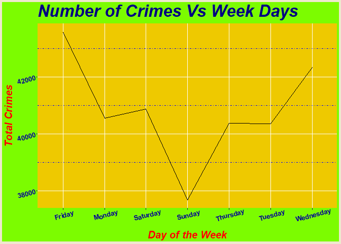

San Fransisco Crime
================
Yordy Castillo
Nov 26, 2019

  - [Introduction to project](#introduction-to-project)
      - [Questions/ Reasons](#questions-reasons)
  - [Packages](#packages)
  - [Variable names](#variable-names)
  - [Reading the data](#reading-the-data)
  - [Conclusions](#conclusions)

# Introduction to project

I will be doing my project on San Fransisco’s 2018-2019 Crime dataset,
san fransisco is the cultural, commercial, and financial center of
Northern California. San Francisco is the 13th-most populous city in the
United States, and the fourth-most populous in California, with 883,305
residents as of 2018. It covers an area of about 46.89 square miles
(121.4 km2) , the website where I got the dataset is shown below and my
reasoning is also down below.


\#\# Link to your data

This is where I got my dataset The R project webpage:
<https://www.kaggle.com/roshansharma/sanfranciso-crime-dataset/>

## Questions/ Reasons

some questions that i want to address are:

1.  to compare the crime rates in the diffrent districts in san
    fransisco
2.  to compare the time of week where crime is most prevalent
3.  what time of day crime occurs

my motivation to do my project on san fransisco crime is since i am a
graduating computer science major and most of the high paying companies
is in san fransisco area , I wanted to compare the diffrent crime rates
and what crimes occurs the most in the diffrent neighborhoods

# Packages

List and Load all packages that will be used in your project and include
one line comment explaining the nature of the list. For example: (dplyr:
to wrangle and manipulate data)

``` r
library(ggplot2) #<-ggplot2 is a system for declaratively creating graphics, based on The Grammar of Graphics
library(dplyr) #<-dplyr provides a flexible grammar of data manipulation.focused on tools for working with data frames
```

    ## 
    ## Attaching package: 'dplyr'

    ## The following objects are masked from 'package:stats':
    ## 
    ##     filter, lag

    ## The following objects are masked from 'package:base':
    ## 
    ##     intersect, setdiff, setequal, union

# Variable names

1.  propxx \<-makes a table compareing the crime in each police
    department
2.  code1-5\< the diffrent Incident Categories
3.  propor\<- just like propxx execpt with analysis of percentage of
    crime in each neighborhood
4.  highscrime\<- places with highest crime
5.  fltr\<- filters out the highest crime
6.  lowestcrime\<- neiborhood with the lowerst crime
7.  ftr\<- filters out the lowest crime
8.  V\<-table for the time of day crime is done.
9.  WeekCrimes\<- what time in the week crime is done
10. Crimes\_Place\<- frequency on crime in each police district
11. BBB\<-graphing the frequency of total crime in each police district
12. aaa\<- graphing total crimes vs the day of the week

# Reading the data

``` r
compare<-read.csv("C:/Users/Yordy/Desktop/RBD/data/sfpolice.csv",stringsAsFactors = F,header = T)
summary(compare)
```

    ##  Incident.Datetime  Incident.Date      Incident.Time      Incident.Year 
    ##  Length:285746      Length:285746      Length:285746      Min.   :2018  
    ##  Class :character   Class :character   Class :character   1st Qu.:2018  
    ##  Mode  :character   Mode  :character   Mode  :character   Median :2018  
    ##                                                           Mean   :2018  
    ##                                                           3rd Qu.:2019  
    ##                                                           Max.   :2019  
    ##                                                                         
    ##  Incident.Day.of.Week Report.Datetime        Row.ID         
    ##  Length:285746        Length:285746      Min.   :6.187e+10  
    ##  Class :character     Class :character   1st Qu.:6.847e+10  
    ##  Mode  :character     Mode  :character   Median :7.477e+10  
    ##                                          Mean   :7.477e+10  
    ##                                          3rd Qu.:8.110e+10  
    ##                                          Max.   :8.742e+10  
    ##                                                             
    ##   Incident.ID     Incident.Number       CAD.Number       
    ##  Min.   :618687   Min.   :        0   Min.   :        1  
    ##  1st Qu.:684746   1st Qu.:180582277   1st Qu.:181772851  
    ##  Median :747736   Median :186215740   Median :183471378  
    ##  Mean   :747695   Mean   :186213529   Mean   :186639278  
    ##  3rd Qu.:810961   3rd Qu.:190515575   3rd Qu.:191612738  
    ##  Max.   :874236   Max.   :981171996   Max.   :999999999  
    ##                                       NA's   :65940      
    ##  Report.Type.Code   Report.Type.Description Filed.Online      
    ##  Length:285746      Length:285746           Length:285746     
    ##  Class :character   Class :character        Class :character  
    ##  Mode  :character   Mode  :character        Mode  :character  
    ##                                                               
    ##                                                               
    ##                                                               
    ##                                                               
    ##  Incident.Code   Incident.Category  Incident.Subcategory
    ##  Min.   : 1000   Length:285746      Length:285746       
    ##  1st Qu.: 6244   Class :character   Class :character    
    ##  Median : 7055   Mode  :character   Mode  :character    
    ##  Mean   :25377                                          
    ##  3rd Qu.:61040                                          
    ##  Max.   :75030                                          
    ##                                                         
    ##  Incident.Description  Resolution        Intersection      
    ##  Length:285746        Length:285746      Length:285746     
    ##  Class :character     Class :character   Class :character  
    ##  Mode  :character     Mode  :character   Mode  :character  
    ##                                                            
    ##                                                            
    ##                                                            
    ##                                                            
    ##       CNN           Police.District    Analysis.Neighborhood
    ##  Min.   :20013000   Length:285746      Length:285746        
    ##  1st Qu.:24019000   Class :character   Class :character     
    ##  Median :24915000   Mode  :character   Mode  :character     
    ##  Mean   :25352947                                           
    ##  3rd Qu.:26407000                                           
    ##  Max.   :54122000                                           
    ##  NA's   :15066                                              
    ##  Supervisor.District    Latitude       Longitude         point          
    ##  Min.   : 1.000      Min.   :37.71   Min.   :-122.5   Length:285746     
    ##  1st Qu.: 3.000      1st Qu.:37.76   1st Qu.:-122.4   Class :character  
    ##  Median : 6.000      Median :37.78   Median :-122.4   Mode  :character  
    ##  Mean   : 5.937      Mean   :37.77   Mean   :-122.4                     
    ##  3rd Qu.: 8.000      3rd Qu.:37.79   3rd Qu.:-122.4                     
    ##  Max.   :11.000      Max.   :37.83   Max.   :-122.4                     
    ##  NA's   :15066       NA's   :15066   NA's   :15066                      
    ##  SF.Find.Neighborhoods Current.Police.Districts
    ##  Min.   :  1.00        Min.   : 1.000          
    ##  1st Qu.: 23.00        1st Qu.: 3.000          
    ##  Median : 44.00        Median : 5.000          
    ##  Mean   : 52.56        Mean   : 4.872          
    ##  3rd Qu.: 86.00        3rd Qu.: 6.000          
    ##  Max.   :117.00        Max.   :10.000          
    ##  NA's   :20841         NA's   :15475           
    ##  Current.Supervisor.Districts Analysis.Neighborhoods
    ##  Min.   : 1.00                Min.   : 1.00         
    ##  1st Qu.: 3.00                1st Qu.: 8.00         
    ##  Median : 7.00                Median :20.00         
    ##  Mean   : 6.64                Mean   :20.95         
    ##  3rd Qu.:10.00                3rd Qu.:34.00         
    ##  Max.   :11.00                Max.   :41.00         
    ##  NA's   :15110                NA's   :15166         
    ##  HSOC.Zones.as.of.2018.06.05 OWED.Public.Spaces
    ##  Min.   :1.00                Min.   : 3.00     
    ##  1st Qu.:1.00                1st Qu.:35.00     
    ##  Median :3.00                Median :35.00     
    ##  Mean   :2.37                Mean   :35.17     
    ##  3rd Qu.:3.00                3rd Qu.:35.00     
    ##  Max.   :5.00                Max.   :80.00     
    ##  NA's   :221735              NA's   :271157    
    ##  Central.Market.Tenderloin.Boundary.Polygon...Updated
    ##  Min.   :1                                           
    ##  1st Qu.:1                                           
    ##  Median :1                                           
    ##  Mean   :1                                           
    ##  3rd Qu.:1                                           
    ##  Max.   :1                                           
    ##  NA's   :247647                                      
    ##  Parks.Alliance.CPSI..27.TL.sites. ESNCAG...Boundary.File
    ##  Min.   : 1.00                     Min.   :1             
    ##  1st Qu.:23.00                     1st Qu.:1             
    ##  Median :24.00                     Median :1             
    ##  Mean   :24.27                     Mean   :1             
    ##  3rd Qu.:24.00                     3rd Qu.:1             
    ##  Max.   :31.00                     Max.   :1             
    ##  NA's   :282183                    NA's   :282530

``` r
library(ggplot2)
library(dplyr)
object.size(compare)
```

    ## 90559704 bytes

``` r
unique(compare$Incident.Category)
```

    ##  [1] "Larceny Theft"                               
    ##  [2] "Robbery"                                     
    ##  [3] "Non-Criminal"                                
    ##  [4] "Other Miscellaneous"                         
    ##  [5] "Disorderly Conduct"                          
    ##  [6] "Motor Vehicle Theft"                         
    ##  [7] "Burglary"                                    
    ##  [8] "Offences Against The Family And Children"    
    ##  [9] "Missing Person"                              
    ## [10] "Malicious Mischief"                          
    ## [11] "Suspicious Occ"                              
    ## [12] "Lost Property"                               
    ## [13] "Assault"                                     
    ## [14] "Forgery And Counterfeiting"                  
    ## [15] "Miscellaneous Investigation"                 
    ## [16] "Fraud"                                       
    ## [17] "Other"                                       
    ## [18] "Stolen Property"                             
    ## [19] "Recovered Vehicle"                           
    ## [20] "Arson"                                       
    ## [21] "Other Offenses"                              
    ## [22] "Vandalism"                                   
    ## [23] "Embezzlement"                                
    ## [24] "Suicide"                                     
    ## [25] "Traffic Collision"                           
    ## [26] "Fire Report"                                 
    ## [27] "Vehicle Misplaced"                           
    ## [28] "Weapons Offense"                             
    ## [29] "Courtesy Report"                             
    ## [30] "Motor Vehicle Theft?"                        
    ## [31] "Warrant"                                     
    ## [32] "Sex Offense"                                 
    ## [33] "Family Offense"                              
    ## [34] "Case Closure"                                
    ## [35] "Suspicious"                                  
    ## [36] "Drug Offense"                                
    ## [37] "Civil Sidewalks"                             
    ## [38] "Rape"                                        
    ## [39] "Prostitution"                                
    ## [40] "Human Trafficking (A), Commercial Sex Acts"  
    ## [41] "Traffic Violation Arrest"                    
    ## [42] "Weapons Carrying Etc"                        
    ## [43] "Vehicle Impounded"                           
    ## [44] ""                                            
    ## [45] "Gambling"                                    
    ## [46] "Human Trafficking, Commercial Sex Acts"      
    ## [47] "Homicide"                                    
    ## [48] "Drug Violation"                              
    ## [49] "Liquor Laws"                                 
    ## [50] "Weapons Offence"                             
    ## [51] "Human Trafficking (B), Involuntary Servitude"

``` r
propxx<-prop.table(table(compare$Police.District))*100
propxx
```

    ## 
    ##    Bayview    Central  Ingleside    Mission   Northern  Out of SF 
    ##   7.992763  15.892436   6.997123  13.495902  13.200185   2.671253 
    ##       Park   Richmond   Southern    Taraval Tenderloin 
    ##   4.687030   5.791507  12.627998   6.702106   9.941696

``` r
code1<-sum(compare$Incident.Category=="Burglary")
code2<-sum(compare$Incident.Category=="Homicide")
code3<-sum(compare$Incident.Category=="Assault")
code4<-sum(compare$Incident.Category=="Sex Offense")
code5<-sum(compare$Incident.Category=="Motor Vehicle Theft")
codes<-c(code1,code2,code3,code4,code5)
lable<-c("Burglary","Homicide","Assault","Sex Offense","Motor Vehicle Theft")
pie(codes,lable,main = "Pie chart for the top crimes in the city of san fransisco",col = rainbow(length(codes)))
```

<!-- -->

``` r
unique(compare$Analysis.Neighborhood)
```

    ##  [1] ""                               "Outer Richmond"                
    ##  [3] "Castro/Upper Market"            "North Beach"                   
    ##  [5] "Lakeshore"                      "Visitacion Valley"             
    ##  [7] "South of Market"                "Mission"                       
    ##  [9] "Bernal Heights"                 "Bayview Hunters Point"         
    ## [11] "Nob Hill"                       "Marina"                        
    ## [13] "Financial District/South Beach" "Russian Hill"                  
    ## [15] "Inner Richmond"                 "Treasure Island"               
    ## [17] "Lone Mountain/USF"              "Mission Bay"                   
    ## [19] "Golden Gate Park"               "Haight Ashbury"                
    ## [21] "Sunset/Parkside"                "Western Addition"              
    ## [23] "Oceanview/Merced/Ingleside"     "Excelsior"                     
    ## [25] "Tenderloin"                     "Portola"                       
    ## [27] "Hayes Valley"                   "Japantown"                     
    ## [29] "Chinatown"                      "Outer Mission"                 
    ## [31] "Glen Park"                      "Potrero Hill"                  
    ## [33] "Pacific Heights"                "West of Twin Peaks"            
    ## [35] "Inner Sunset"                   "Noe Valley"                    
    ## [37] "Presidio Heights"               "Presidio"                      
    ## [39] "Twin Peaks"                     "Seacliff"                      
    ## [41] "McLaren Park"                   "Lincoln Park"                  
    ## [43] "null"

``` r
propor<-prop.table(table(compare$Analysis.Neighborhood))*100
propor
```

    ## 
    ##                                         Bayview Hunters Point 
    ##                     5.27251475                     5.43979618 
    ##                 Bernal Heights            Castro/Upper Market 
    ##                     1.60142224                     2.90432762 
    ##                      Chinatown                      Excelsior 
    ##                     1.90553849                     1.51848145 
    ## Financial District/South Beach                      Glen Park 
    ##                     8.97965326                     0.47069775 
    ##               Golden Gate Park                 Haight Ashbury 
    ##                     1.04813366                     1.60982131 
    ##                   Hayes Valley                 Inner Richmond 
    ##                     2.56801495                     1.24201214 
    ##                   Inner Sunset                      Japantown 
    ##                     1.09607834                     1.02188657 
    ##                      Lakeshore                   Lincoln Park 
    ##                     1.14997235                     0.10673815 
    ##              Lone Mountain/USF                         Marina 
    ##                     1.13142441                     2.21630399 
    ##                   McLaren Park                        Mission 
    ##                     0.09238974                    11.04757372 
    ##                    Mission Bay                       Nob Hill 
    ##                     1.62626948                     2.71149902 
    ##                     Noe Valley                    North Beach 
    ##                     0.85810475                     3.11710400 
    ##                           null     Oceanview/Merced/Ingleside 
    ##                     0.01959782                     0.97989123 
    ##                  Outer Mission                 Outer Richmond 
    ##                     1.29240654                     2.03432419 
    ##                Pacific Heights                        Portola 
    ##                     1.54262877                     1.05898245 
    ##                   Potrero Hill                       Presidio 
    ##                     1.48243545                     0.22537498 
    ##               Presidio Heights                   Russian Hill 
    ##                     0.53579053                     2.21175450 
    ##                       Seacliff                South of Market 
    ##                     0.10463839                     8.33747454 
    ##                Sunset/Parkside                     Tenderloin 
    ##                     2.74789498                     9.91929896 
    ##                Treasure Island                     Twin Peaks 
    ##                     0.30341632                     0.46404849 
    ##              Visitacion Valley             West of Twin Peaks 
    ##                     1.06038230                     1.85829373 
    ##               Western Addition 
    ##                     3.08560750

``` r
highcrime<-c("Financial District/South Beach"," Mission","South of Market","Tenderloin","Bayview Hunters Point")
fltr<-filter(compare, compare$Analysis.Neighborhood %in% highcrime)
lowestcrime<-c("Treasure Island"," Seacliff","McLaren Park","Lincoln Park","Twin Peaks")
ftr<-filter(compare, Analysis.Neighborhood %in% lowestcrime)
tbl1<-table(fltr$Analysis.Neighborhood)
tbl1
```

    ## 
    ##          Bayview Hunters Point Financial District/South Beach 
    ##                          15544                          25659 
    ##                South of Market                     Tenderloin 
    ##                          23824                          28344

``` r
tbl2<-table(ftr$Analysis.Neighborhood)
tbl2
```

    ## 
    ##    Lincoln Park    McLaren Park Treasure Island      Twin Peaks 
    ##             305             264             867            1326

``` r
barplot(tbl1, col=colors()[2:10],main = "Neighborhoods with the highest Crimes",xlab="Neighborhoods",ylab="Frequency")
```

<!-- -->

``` r
barplot(tbl2, col=colors()[11:57],main = "Neighborhoods with the lowest Crimes",xlab="Neighborhoods",ylab="Frequency")
```

<!-- -->

``` r
V<-table(compare$Incident.Time)
barplot(V, main="Crime distribution during different times in a day")
```

<!-- -->

``` r
WeekCrimes = as.data.frame(table(compare$Incident.Day.of.Week))
WeekCrimes
```

    ##        Var1  Freq
    ## 1    Friday 43579
    ## 2    Monday 40546
    ## 3  Saturday 40877
    ## 4    Sunday 37677
    ## 5  Thursday 40373
    ## 6   Tuesday 40353
    ## 7 Wednesday 42341

``` r
ggplot(data=compare, aes(compare$Supervisor.District)) + 
  geom_histogram(breaks=seq(0, 11, by =1), 
                 col="red", 
                 aes(fill=..count..))+
  scale_fill_gradient("Count", low = "blue", high = "red")+labs(title="Histogram for the Supervisor District") +
  labs(x="District", y="Count")
```

    ## Warning: Removed 15066 rows containing non-finite values (stat_bin).

<!-- -->

``` r
Crimes_Place =as.data.frame(table(compare$Police.District))
head(Crimes_Place)
```

    ##        Var1  Freq
    ## 1   Bayview 22839
    ## 2   Central 45412
    ## 3 Ingleside 19994
    ## 4   Mission 38564
    ## 5  Northern 37719
    ## 6 Out of SF  7633

``` r
BBB<-ggplot(Crimes_Place, aes(x=Var1, y=Freq)) + geom_line(aes(group=1))+ xlab("Police District") + ylab("Total Crimes")+labs(title="Total Crime Vs Police Districts") 

BBB +  theme(plot.background = element_rect(fill=colors()[103], color=colors()[74],size=3),panel.background = element_rect(fill=colors()[3]), panel.grid.minor = element_line(colour="blue", linetype="3313", size=0.5),
plot.title=element_text(face="bold.italic",size="25", color="blue"),
axis.title=element_text(face="bold.italic",size=15, color="purple"),
axis.text=element_text(face="bold", size=10,color="blue", angle = 15))
```

<!-- -->

``` r
aaa<-ggplot(WeekCrimes, aes(x=Var1, y=Freq)) + geom_line(aes(group=1))+ xlab("Day of the Week") + ylab("Total Crimes")+labs(title="Number of Crimes Vs Week Days") 
aaa +  theme(plot.background = element_rect(fill=colors()[393], color=colors()[65],size=3),panel.background = element_rect(fill=colors()[144]), panel.grid.minor = element_line(colour="blue", linetype="3313", size=0.5),
plot.title=element_text(face="bold.italic",size="25", color="navy"),
axis.title=element_text(face="bold.italic",size=15, color="Red"),
axis.text=element_text(face="bold", size=10,color="darkblue", angle = 15))
```

<!-- -->
\# Data Explorations

Show the size of the data

``` r
str(compare)
```

    ## 'data.frame':    285746 obs. of  35 variables:
    ##  $ Incident.Datetime                                   : chr  "2019/08/15 11:41:00 AM" "2019/09/17 10:00:00 PM" "2019/10/04 02:25:00 PM" "2019/10/03 07:30:00 PM" ...
    ##  $ Incident.Date                                       : chr  "2019/08/15" "2019/09/17" "2019/10/04" "2019/10/03" ...
    ##  $ Incident.Time                                       : chr  "11:41" "22:00" "14:25" "19:30" ...
    ##  $ Incident.Year                                       : int  2019 2019 2019 2019 2019 2019 2019 2019 2019 2019 ...
    ##  $ Incident.Day.of.Week                                : chr  "Thursday" "Tuesday" "Friday" "Thursday" ...
    ##  $ Report.Datetime                                     : chr  "2019/10/01 02:06:00 PM" "2019/10/02 10:01:00 PM" "2019/10/04 04:13:00 PM" "2019/10/03 11:25:00 PM" ...
    ##  $ Row.ID                                              : num  8.54e+10 8.54e+10 8.54e+10 8.54e+10 8.54e+10 ...
    ##  $ Incident.ID                                         : int  854240 854266 854426 854197 854463 854257 854450 854440 854357 854343 ...
    ##  $ Incident.Number                                     : int  196208089 196208205 190746203 190744514 190746532 196208142 190746059 190746184 190745409 190740669 ...
    ##  $ CAD.Number                                          : int  NA NA 192772728 192764437 192772932 NA 192772346 192772064 192770635 NA ...
    ##  $ Report.Type.Code                                    : chr  "II" "II" "II" "II" ...
    ##  $ Report.Type.Description                             : chr  "Coplogic Initial" "Coplogic Initial" "Initial" "Initial" ...
    ##  $ Filed.Online                                        : chr  "true" "true" "" "" ...
    ##  $ Incident.Code                                       : int  6374 6374 3474 6244 51040 6224 26080 19089 7025 6304 ...
    ##  $ Incident.Category                                   : chr  "Larceny Theft" "Larceny Theft" "Robbery" "Larceny Theft" ...
    ##  $ Incident.Subcategory                                : chr  "Larceny Theft - Other" "Larceny Theft - Other" "Robbery - Other" "Larceny - From Vehicle" ...
    ##  $ Incident.Description                                : chr  "Theft, Other Property, >$950" "Theft, Other Property, >$950" "Robbery, Att., W/ Force" "Theft, From Locked Vehicle, >$950" ...
    ##  $ Resolution                                          : chr  "Open or Active" "Open or Active" "Open or Active" "Open or Active" ...
    ##  $ Intersection                                        : chr  "" "" "BALBOA ST \\ GREAT HWY" "MARKET ST \\ RESERVOIR ST" ...
    ##  $ CNN                                                 : num  NA NA 28009000 25877000 27919000 ...
    ##  $ Police.District                                     : chr  "Central" "Out of SF" "Richmond" "Mission" ...
    ##  $ Analysis.Neighborhood                               : chr  "" "" "Outer Richmond" "Castro/Upper Market" ...
    ##  $ Supervisor.District                                 : int  NA NA 1 8 1 3 1 7 10 6 ...
    ##  $ Latitude                                            : num  NA NA 37.8 37.8 37.8 ...
    ##  $ Longitude                                           : num  NA NA -123 -122 -123 ...
    ##  $ point                                               : chr  "" "" "POINT (-122.51129492624534 37.77507596005672)" "POINT (-122.42746205880601 37.76877049785351)" ...
    ##  $ SF.Find.Neighborhoods                               : int  NA NA 8 28 6 99 5 62 75 32 ...
    ##  $ Current.Police.Districts                            : int  NA NA 8 3 8 6 8 10 9 1 ...
    ##  $ Current.Supervisor.Districts                        : int  NA NA 4 5 4 3 4 8 9 10 ...
    ##  $ Analysis.Neighborhoods                              : int  NA NA 29 5 29 23 29 16 40 34 ...
    ##  $ HSOC.Zones.as.of.2018.06.05                         : int  NA NA NA 5 NA NA NA NA NA 1 ...
    ##  $ OWED.Public.Spaces                                  : int  NA NA NA NA NA NA NA NA NA NA ...
    ##  $ Central.Market.Tenderloin.Boundary.Polygon...Updated: int  NA NA NA NA NA NA NA NA NA 1 ...
    ##  $ Parks.Alliance.CPSI..27.TL.sites.                   : int  NA NA NA NA NA NA NA NA NA NA ...
    ##  $ ESNCAG...Boundary.File                              : int  NA NA NA NA NA NA NA NA NA NA ...

``` r
summary(compare)
```

    ##  Incident.Datetime  Incident.Date      Incident.Time      Incident.Year 
    ##  Length:285746      Length:285746      Length:285746      Min.   :2018  
    ##  Class :character   Class :character   Class :character   1st Qu.:2018  
    ##  Mode  :character   Mode  :character   Mode  :character   Median :2018  
    ##                                                           Mean   :2018  
    ##                                                           3rd Qu.:2019  
    ##                                                           Max.   :2019  
    ##                                                                         
    ##  Incident.Day.of.Week Report.Datetime        Row.ID         
    ##  Length:285746        Length:285746      Min.   :6.187e+10  
    ##  Class :character     Class :character   1st Qu.:6.847e+10  
    ##  Mode  :character     Mode  :character   Median :7.477e+10  
    ##                                          Mean   :7.477e+10  
    ##                                          3rd Qu.:8.110e+10  
    ##                                          Max.   :8.742e+10  
    ##                                                             
    ##   Incident.ID     Incident.Number       CAD.Number       
    ##  Min.   :618687   Min.   :        0   Min.   :        1  
    ##  1st Qu.:684746   1st Qu.:180582277   1st Qu.:181772851  
    ##  Median :747736   Median :186215740   Median :183471378  
    ##  Mean   :747695   Mean   :186213529   Mean   :186639278  
    ##  3rd Qu.:810961   3rd Qu.:190515575   3rd Qu.:191612738  
    ##  Max.   :874236   Max.   :981171996   Max.   :999999999  
    ##                                       NA's   :65940      
    ##  Report.Type.Code   Report.Type.Description Filed.Online      
    ##  Length:285746      Length:285746           Length:285746     
    ##  Class :character   Class :character        Class :character  
    ##  Mode  :character   Mode  :character        Mode  :character  
    ##                                                               
    ##                                                               
    ##                                                               
    ##                                                               
    ##  Incident.Code   Incident.Category  Incident.Subcategory
    ##  Min.   : 1000   Length:285746      Length:285746       
    ##  1st Qu.: 6244   Class :character   Class :character    
    ##  Median : 7055   Mode  :character   Mode  :character    
    ##  Mean   :25377                                          
    ##  3rd Qu.:61040                                          
    ##  Max.   :75030                                          
    ##                                                         
    ##  Incident.Description  Resolution        Intersection      
    ##  Length:285746        Length:285746      Length:285746     
    ##  Class :character     Class :character   Class :character  
    ##  Mode  :character     Mode  :character   Mode  :character  
    ##                                                            
    ##                                                            
    ##                                                            
    ##                                                            
    ##       CNN           Police.District    Analysis.Neighborhood
    ##  Min.   :20013000   Length:285746      Length:285746        
    ##  1st Qu.:24019000   Class :character   Class :character     
    ##  Median :24915000   Mode  :character   Mode  :character     
    ##  Mean   :25352947                                           
    ##  3rd Qu.:26407000                                           
    ##  Max.   :54122000                                           
    ##  NA's   :15066                                              
    ##  Supervisor.District    Latitude       Longitude         point          
    ##  Min.   : 1.000      Min.   :37.71   Min.   :-122.5   Length:285746     
    ##  1st Qu.: 3.000      1st Qu.:37.76   1st Qu.:-122.4   Class :character  
    ##  Median : 6.000      Median :37.78   Median :-122.4   Mode  :character  
    ##  Mean   : 5.937      Mean   :37.77   Mean   :-122.4                     
    ##  3rd Qu.: 8.000      3rd Qu.:37.79   3rd Qu.:-122.4                     
    ##  Max.   :11.000      Max.   :37.83   Max.   :-122.4                     
    ##  NA's   :15066       NA's   :15066   NA's   :15066                      
    ##  SF.Find.Neighborhoods Current.Police.Districts
    ##  Min.   :  1.00        Min.   : 1.000          
    ##  1st Qu.: 23.00        1st Qu.: 3.000          
    ##  Median : 44.00        Median : 5.000          
    ##  Mean   : 52.56        Mean   : 4.872          
    ##  3rd Qu.: 86.00        3rd Qu.: 6.000          
    ##  Max.   :117.00        Max.   :10.000          
    ##  NA's   :20841         NA's   :15475           
    ##  Current.Supervisor.Districts Analysis.Neighborhoods
    ##  Min.   : 1.00                Min.   : 1.00         
    ##  1st Qu.: 3.00                1st Qu.: 8.00         
    ##  Median : 7.00                Median :20.00         
    ##  Mean   : 6.64                Mean   :20.95         
    ##  3rd Qu.:10.00                3rd Qu.:34.00         
    ##  Max.   :11.00                Max.   :41.00         
    ##  NA's   :15110                NA's   :15166         
    ##  HSOC.Zones.as.of.2018.06.05 OWED.Public.Spaces
    ##  Min.   :1.00                Min.   : 3.00     
    ##  1st Qu.:1.00                1st Qu.:35.00     
    ##  Median :3.00                Median :35.00     
    ##  Mean   :2.37                Mean   :35.17     
    ##  3rd Qu.:3.00                3rd Qu.:35.00     
    ##  Max.   :5.00                Max.   :80.00     
    ##  NA's   :221735              NA's   :271157    
    ##  Central.Market.Tenderloin.Boundary.Polygon...Updated
    ##  Min.   :1                                           
    ##  1st Qu.:1                                           
    ##  Median :1                                           
    ##  Mean   :1                                           
    ##  3rd Qu.:1                                           
    ##  Max.   :1                                           
    ##  NA's   :247647                                      
    ##  Parks.Alliance.CPSI..27.TL.sites. ESNCAG...Boundary.File
    ##  Min.   : 1.00                     Min.   :1             
    ##  1st Qu.:23.00                     1st Qu.:1             
    ##  Median :24.00                     Median :1             
    ##  Mean   :24.27                     Mean   :1             
    ##  3rd Qu.:24.00                     3rd Qu.:1             
    ##  Max.   :31.00                     Max.   :1             
    ##  NA's   :282183                    NA's   :282530

**numbers of rows and columns:**

285746 rows and 35 columns

**classes of columns, how many `NA`?**

most of the columns have variables up until the $Supervisor.District the
columns afterwards start to have missing variables

# Conclusions

Highlight the information obtained from your project aboout the data.
Include some questions that you wish to investigate further.

**some highlights:** 1. Assault is the most common crime done in san
fransisco

2.  Tenderlion has the highest crime rate, while McLaren park has the
    lowest

3.  The time of day that crime is most frequent is around 12ish in the
    afternoon and the least frequent is around 5am ,and friday is the
    when the most amounts of crime are done

**statment:**

my r contributions is about 90%, i did google some ways to create
diffrent graphs.
